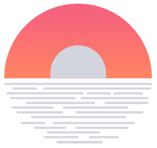
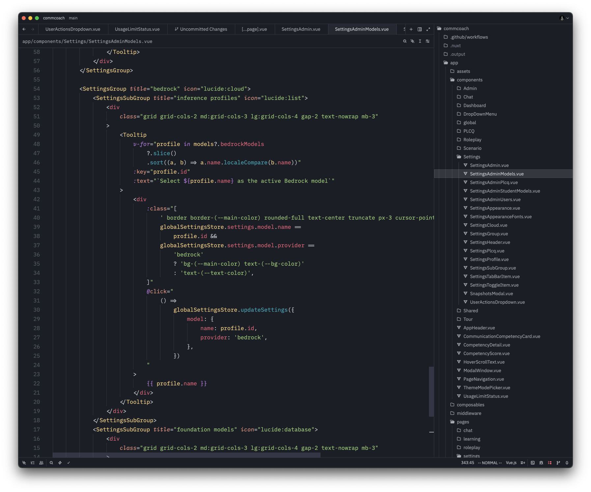

<h3 align="center">
 
Horizon Extended (Zed)

</h3>

Bringing over the <i>mildly</i> popular <a href="https://github.com/lancewilhelm/horizon-extended">Horizon Extended VSCode theme</a> to Zed. This theme is also available for <a href="https://github.com/lancewilhelm/horizon-extended.nvim">Neovim</a>.

